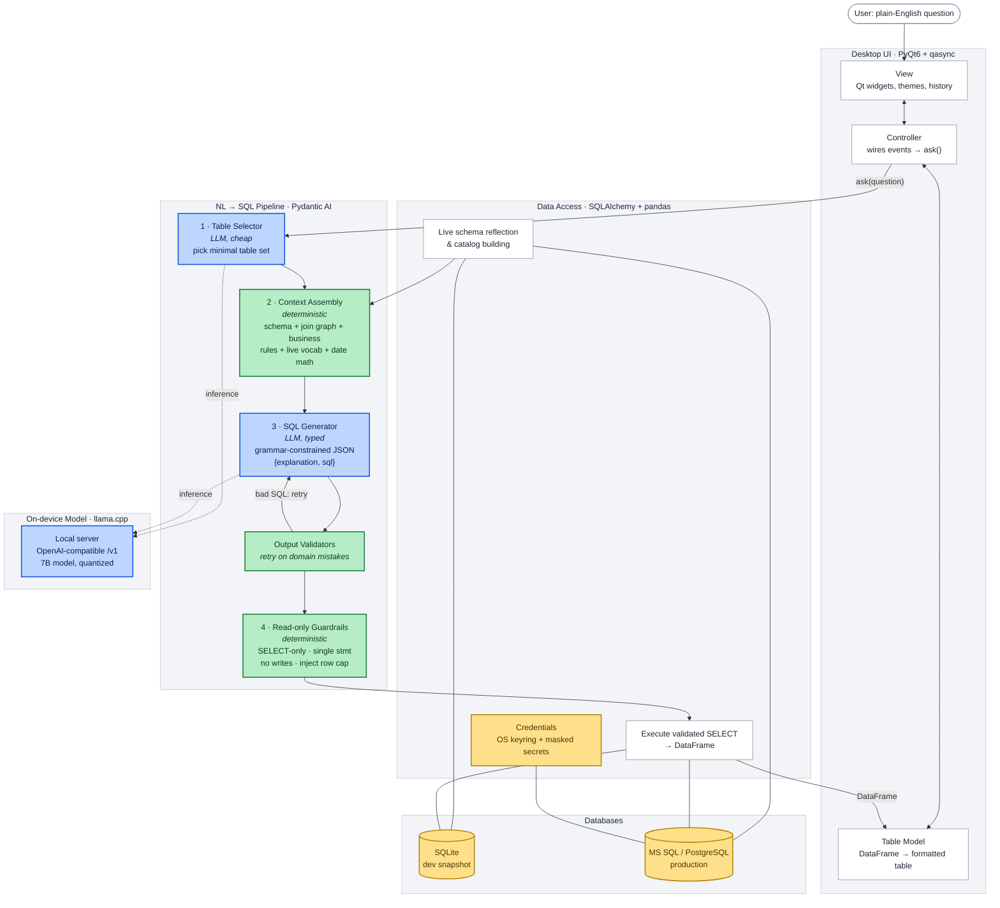

# Natural-Language SQL Analyst — On-Premise Business Intelligence

> A desktop app that lets non-technical staff answer questions about a large
> business database in plain English. Users type something like *"top 10 customers by revenue growth
> across the last two fiscal years"*; it generates safe, read-only SQL, runs it, and returns a
> formatted table ready to be integrated into sales reports.
>
> **Powered by a Large Language Model running entirely on-premise.** No customer data,
> order history, or database schema ever leaves the machine. No per-query API
> bill, no cloud dependency, and it works on an air-gapped network.

*This is an anonymized production-oriented project.
Company names, credentials, table names, and business logic have been removed
or genericized. No source code is included here — this document describes the
system design and the engineering decisions behind it.*

---

## The problem I was faced with

A mid-sized distributor ran its operations on a wide, decades-old ERP database:
a few hundred columns on the main order table alone, cryptic column names,
values-stored-as-text quirks, and a thick layer of tribal knowledge about what
counts as a "real" sale or an "active" customer.

Answering even simple business questions ("how much did we ship to the West
region in Q3?") meant filing a ticket with the one or two people who could
write the SQL. That's a bottleneck for the business and busywork for the
analysts.

**Goal:** let anyone ask questions in natural language and get a trustworthy
answer — without handing an LLM the keys to a production database, and without
sending proprietary data to a third-party API.

---

## What it does

- **Plain-English → SQL.** "Which sales reps beat their region average last
  quarter?" becomes a correct, parameterized query.
- **Runs 100% locally.** The model is served on-device; the database stays on
  the internal network. Nothing is sent to the cloud.
- **Read-only by construction.** Multiple independent layers guarantee that
  only `SELECT` statements ever reach the database (details below).
- **Encodes the business's rules automatically.** "Active customers only,"
  "revenue means the summed line subtotal, not price × quantity," fiscal-year
  date boundaries — all within the model's context and applied whether or not the user mentions them.
- **Desktop GUI** with query history, one-click SQL copy, light/dark themes,
  and accounting-style number formatting. Making the app feel familiar, accessible and unintimidating.
- **The generated SQL is always visible** (on hover / one-click copy) so an
  analyst can verify or reuse it. The tool is transparent, not a black box.

---

## Tech stack

| Layer                       | Choice                                                           | Why                                                                                                                                             |
| --------------------------- | ---------------------------------------------------------------- | ----------------------------------------------------------------------------------------------------------------------------------------------- |
| **Local LLM runtime** | `llama.cpp` server (OpenAI-compatible API)                     | Runs a quantized model on bare-metal; exposes a standard`/v1` endpoint so the app code is provider-agnostic.                                  |
| **Model**             | A 7B-parameter code/SQL-specialized model, Q5 quantized (~5 GB)  | Best SQL quality that fits comfortably in 16 GB of unified memory with room for a 16k context window.                                           |
| **Agent framework**   | Pydantic AI                                                      | Typed, structured LLM output with validators and a built-in retry loop. Swapping models is a one-line change.                                   |
| **Structured output** | Grammar-constrained JSON (server-side`response_format`)        | Forces the model to return a valid`{explanation, sql}` object every time — no brittle text parsing.                                          |
| **Data access**       | SQLAlchemy + pandas                                              | Dialect-portable engine, schema reflection, results straight into DataFrames.                                                                   |
| **Databases**         | SQLite (dev snapshot) · MS SQL Server & PostgreSQL (production) | Develop offline against a local snapshot; the same pipeline targets production via a dialect abstraction.                                       |
| **Desktop UI**        | PyQt6 +`qasync`                                                | Native cross-platform GUI;`qasync` bridges Qt's event loop with `asyncio` so you can run queries concurrently without freezing the window. |
| **Secrets**           | OS keyring +`.env`, wrapped in typed secret types              | Credentials never live in source; secret values are masked in logs and tracebacks.                                                              |
| **Tooling**           | `uv`, `ruff`, `ty`                                         | Fast, reproducible dependency management and a clean codebase.                                                                                  |

---

## Architecture



> **· Blue** = LLM inference (the two genuinely fuzzy jobs)
> · **Green** = deterministic code that fences the model in on both sides
> · **Yellow** = data & secrets. Everything that *can* be deterministic *is*.

---

## How it works (the short version)

```
 Natural-language question
          │
          ▼
 ┌───────────────────┐   "which tables do I even need?"
 │ 1. Table selector │──────────────────────────────────┐
 │    (LLM, cheap)   │   picks a minimal set from a       │
 └───────────────────┘   compact catalog of all tables    │
          │                                                │
          ▼                                                │
 ┌───────────────────┐   reflect ONLY those tables +       │
 │ 2. Context build  │   inject business rules, the join   │
 │    (deterministic)│   graph, live value vocabularies,   │
 └───────────────────┘   and pre-computed date ranges      │
          │                                                │
          ▼                                                │
 ┌───────────────────┐   emits {explanation, sql} as       │
 │ 3. SQL generator  │   grammar-constrained JSON;          │
 │    (LLM, typed)   │   output validators bounce bad SQL   │
 └───────────────────┘   back to the model to fix          │
          │                                                │
          ▼                                                │
 ┌───────────────────┐   single-statement? SELECT-only?    │
 │ 4. Guardrails     │   no forbidden keywords? inject a    │
 │    (deterministic)│   row LIMIT / TOP cap                │
 └───────────────────┘                                     │
          │                                                │
          ▼                                                │
 ┌───────────────────┐                                     │
 │ 5. Execute → table│◀────────────────────────────────────┘
 └───────────────────┘   results as a DataFrame that can be exported to Excel.
```

See **[ARCHITECTURE.md](./ARCHITECTURE.md)** for the full design.

---

## Benefits

- **Self-service analytics.** Business users answer their own questions in
  seconds; the SQL experts stop being a ticket queue.
- **Privacy by design.** Schema and data never leave the building. Viable for
  regulated or air-gapped environments where a cloud LLM is a non-starter.
- **Zero marginal cost.** No per-token API charges — run as many queries as you
  like on hardware you already own.
- **Deterministic and auditable.** Temperature 0 means the same question yields
  the same SQL every time, and that SQL is always shown for review.
- **Safe against a production database.** The database only ever sees read-only
  queries, enforced by layers that don't depend on the model behaving.

---

## What I learned

Let's be honest, though most small to even mid-sized businesses may believe in the technology, they are just not ready to trust some monolithic AI provider with their data, let alone incur a hefty monthly AI bill. Naturally, this led me to learning to host my first LLM on-premise, which was made extremely straightforward thanks to `llama.cpp.`I wanted to create a system with a relatively small scope, focusing on the sales/business side, empowering non-technical users to query and draw business insights from the data. I built out as much business context as possible, to provide to the model and build trust in the answers it provided to users. `Pydantic AI` made it really easy to add structure and validation to the naturally messy LLM output, as well as add a much needed element of consistency. The organization was used to desktop tools, built with Qt6, so naturally that's what I opted for. The local LLM paired with a cached SQLite snapshot of the database also meant the production database wasn't overloaded with potentially expensive queries. This also allowed for the workflow between the user and the AI to remain snappy.

- **Prompt design beats model size for text-to-SQL.** A 7B model with a tight,
  accurate schema and the business rules spelled out beats a much larger model
  fed the raw database. Most of the engineering effort went into *context*, not
  the model.
- **Keep the prompt small and relevant.** A two-stage approach — first ask a
  cheap LLM call which tables are relevant, then reflect only those — was the
  single biggest accuracy win. Dumping a 200-column table into the prompt
  drowns the model and burns context.
- **Don't trust the model for what code can do deterministically.** Date math
  (fiscal-year boundaries) is computed in Python and handed to the model as
  literal values. Guardrails, row limits, and dialect-specific syntax are
  applied in code, never left to the model.
- **Structured output + validators is a superpower.** Grammar-constrained JSON
  removes a whole class of parsing bugs, and output validators let you catch
  domain mistakes (e.g. selecting an internal join key instead of a
  user-facing value) and bounce them back for an automatic retry.
- **Hardware sets the ceiling.** On 16 GB of unified memory the practical limit
  is a ~7–8B model at Q4/Q5. Picking the quantization and context length is a
  real trade-off between quality, speed, and headroom.
- **A dev snapshot changes everything.** Developing against a local SQLite copy
  of the data made the whole loop fast, offline, and safe to hammer — while the
  identical pipeline still targets the real MS SQL / PostgreSQL servers in
  production.
- **Async GUI is fiddly but worth it.** Bridging Qt's event loop with `asyncio`
  keeps the UI responsive while a query runs, instead of freezing on every
  request.
